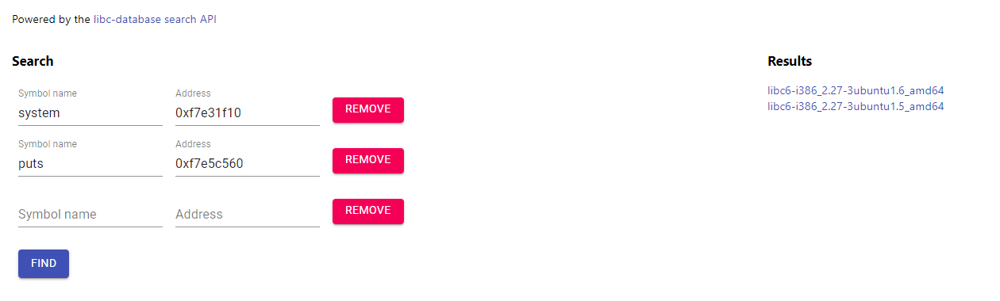

# Guessing game 2
[Link](https://play.picoctf.org/practice/challenge/89?category=6&page=3) to CTF  
By looking at the provided makefile we can see that canary is enabled.
```Makefile
all:
	gcc -m32 -no-pie -Wl,-z,relro,-z,now -o vuln vuln.c
clean:
	rm vuln
```
Let's take a look at the code:
```C
.....

int do_stuff() {
	long ans = (get_random() % 4096) + 1;
	int res = 0;
	
	printf("What number would you like to guess?\n");
	char guess[BUFSIZE];
	fgets(guess, BUFSIZE, stdin);
	
	long g = atol(guess);
	if (!g) {
		printf("That's not a valid number!\n");
	} else {
		if (g == ans) {
			printf("Congrats! You win! Your prize is this print statement!\n\n");
			res = 1;
		} else {
			printf("Nope!\n\n");
		}
	}
	return res;
}

....

int main(int argc, char **argv){
	setvbuf(stdout, NULL, _IONBF, 0);
	// Set the gid to the effective gid
	// this prevents /bin/sh from dropping the privileges
	gid_t gid = getegid();
	setresgid(gid, gid, gid);
	
	int res;
	
	printf("Welcome to my guessing game!\n");
	printf("Version: %x\n\n", get_version());
	
	while (1) {
		res = do_stuff();
		if (res) {
			win();
		}
	}
	
	return 0;
}
```
Please note that in order to reach the "Win" state, our initial step involves determining the generated random number. However, the question remains: how can we achieve this? This is where we can use [this site](https://libc.rip/). By supplying the addresses of the libc functions, the site can identify the specific version of the libc that the binary employs.


Then downloading the libc and applying a patch using patchelf. Once this is done, the next step is debugging the program, which enables us to locate the number that is seemingly "randomly" generated which is -3727.

Now let's examin win function.
```C
void win() {
	char winner[BUFSIZE];
	printf("New winner!\nName? ");
	gets(winner);
	printf("Congrats: ");
	printf(winner);
	printf("\n\n");
}
```
We see two vulnerabilities in this scenario:

1. A classic buffer overflow vulnerability.
2. printf formatting.
In terms of the buffer overflow issue, a significant challenge arises due to the presence of the canary protection mechanism. So we will use printf to leak the canary value.

Once we successfully obtain the canary value, the subsequent step involves leaking the address of the "puts" function in the plt. While the actual location of "puts" in the PLT might vary across executions, the consistent offset from the base remains unchanged. Therefore, our focus should be on determining the offset within glibc. This will subsequently allow us to calculate the addresses of the "/bin/sh" string and the "system" function.

```bash
readelf -s libc.so | grep puts
213: 00067560   474 FUNC    GLOBAL DEFAULT   13 _IO_puts@@GLIBC_2.0
455: 00067560   474 FUNC    WEAK   DEFAULT   13 puts@@GLIBC_2.0
```
```bash
strings -tx libc.so | grep "/bin/sh"
17b9db /bin/sh
```
From here is just return to libc technich.

Thanks for reading. For the full exploit please check out the [python code](./e.py)
