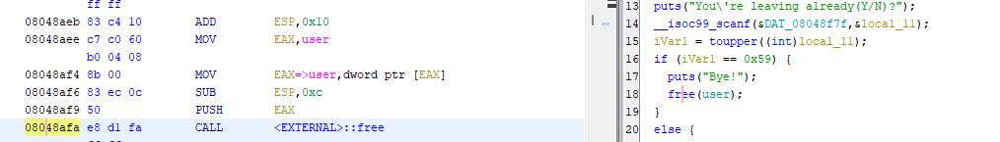
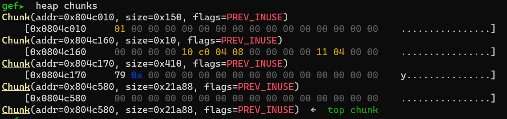
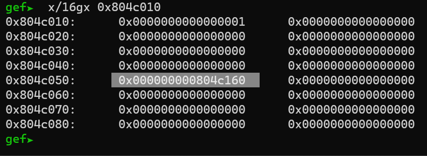
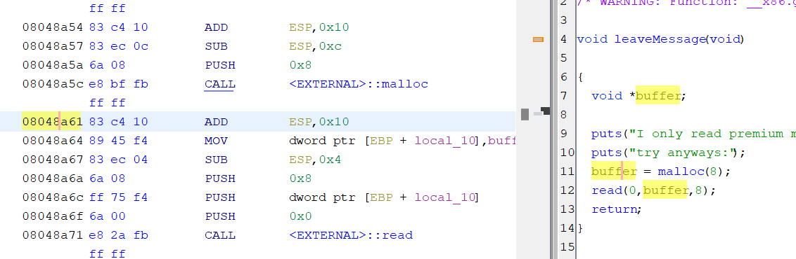
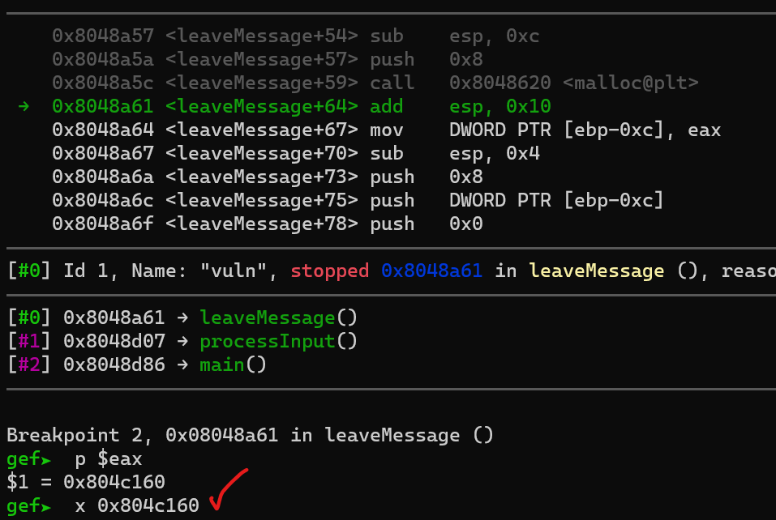
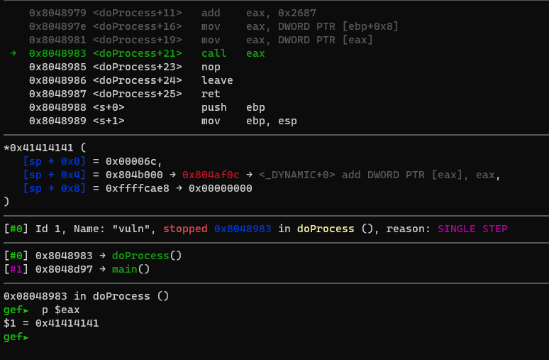

# Unsubscriptions Are Free

picoCTF provides a binary and and the source code. Let's dive right into the source code and see what stands out immediately.

I have included the [source code](./vuln.c) in this folder so that you can also examine it yourself.

OK this one is too obvious. (A function that prints the pointer to another function responsible for printing the flag.).
```C
void s()
{
	printf("OOP! Memory leak...%p\n", hahaexploitgobrrr);
	puts("Thanks for subsribing! I really recommend becoming a premium member!");
}
```
Indirect call. Come on... :facepalm:
```C
void doProcess(cmd *obj)
{
	(*obj->whatToDo)();
}
```
We are able to free the user pointer
```C

void i(){
	char response;
	puts("You're leaving already(Y/N)?");
	scanf(" %c", &response);
	if (toupper(response) == 'Y'){
		puts("Bye!");
		free(user);
	}
	else{
		puts("Ok. Get premium membership please!");
	}
}
```
Then, we can allocate a new pointer and set its value. As mentioned in the previous write-up, we already know that tcache gives us the most recently deallocated pointer when we call malloc. So we can use the following function:
```C
void leaveMessage(){
	puts("I only read premium member messages but you can ");
	puts("try anyways:");
	char *msg = (char *)malloc(8);
	read(0, msg, 8);
}
```
The steps are straightforward:

1. Obtain the address value of the desired function.
2. Free the user pointer.
3. Use malloc to overwrite the user pointer with the address of the flag function.
4. Trigger an indirect call to invoke the flag function.

Just to make sure we are right let's debug this, let's set a break point after:  
free
  
And check what chunk address saved in tcache.  
 
 

We need to ensure that the address allocated by malloc is the same next time.
`0x0804c0160`
   
  

For now, I'll fill the check data with "AAAAAAA", and we'll pretend that it represents the vulnerable function's address. And that's it. Now, when doProcess is called again, it will have the address of the vulnerable function.

  

As you see it's going to call 41414141
:partying_face:

That's it, Thanks for reading.
