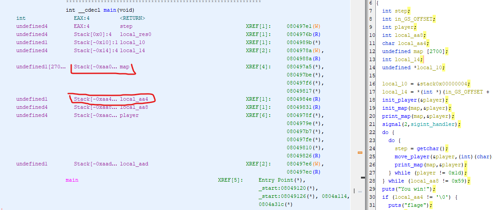

# babygame01
[In this challenge](https://play.picoctf.org/practice/challenge/345?category=6&page=1), picoCTF provides a binary without libc library.

I encountered an issue when trying to run the provided binary from picoCTF. The error message displayed was:
```bash
./game: /lib32/libc.so.6: version `GLIBC_2.34' not found (required by ./game)
```
To resolve this issue, I downloaded glibc version 2.34 and compiled it locally. Now, I need to ensure that the binary uses this specific version of the libc library. This can be achieved by using the patchelf tool.  

First, let's check the current rpath (run-time library search path) of the binary:

```bash
patchelf --print-rpath ./game
libc.so.6
```
Next, we can replace the needed library with the newly compiled libc.so.6 using the following command:
```bash
patchelf --replace-needed libc.so.6 $(pwd)/libc.so.6 ./game1
```
By executing these steps, the binary should now run without any issues.

Let's look at the code
```C
int main(void) {
  int step;
  int in_GS_OFFSET;
  int player;
  int local_aa8;
  char local_aa4;
  undefined map [2700];
  int local_14;
  undefined *local_10;
  
  local_10 = &stack0x00000004;
  local_14 = *(int *)(in_GS_OFFSET + 0x14);
  init_player(&player);
  init_map(map,&player);
  print_map(map,&player);
  signal(2,sigint_handler);
  do {
    do {
      step = getchar();
      move_player(&player,(int)(char)step,map);
      print_map(map,&player);
    } while (player != 0x1d);
  } while (local_aa8 != 0x59);
  puts("You win!");
  if (local_aa4 != '\0') {
    puts("flage");
    win();
    fflush(stdout);
  }
  step = 0;
  if (local_14 != *(int *)(in_GS_OFFSET + 0x14)) {
    step = __stack_chk_fail_local();
  }
  return step;
}
```
To win this CTF, it is evident that we must successfully satisfy the following if condition:
```C
if (local_aa4 != '\0')
```
Let's look at the local variables.


In order to achieve our goal, we need to navigate to the offset of -0xaa4 within the map. The map itself is located at -0xaa0 which is approximately -2700 bytes away from the esp.

Upon examining the move_player function, we can observe that there are no boundary checks implemented. As a result, we simply need to move to the cell at the offset of -4 within the array, which will overwrite the checked value.
```C
void move_player(int *player,char step,int map) {
  int iVar1;
  
  if (step == 'l') {
    iVar1 = getchar();
    player_tile = (undefined)iVar1;
  }
  if (step == 'p') {
    solve_round(map,player);
  }
  *(undefined *)(*player * 0x5a + map + player[1]) = 0x2e;
  if (step == 'w') {
    *player = *player + -1;
  }
  else if (step == 's') {
    *player = *player + 1;
  }
  else if (step == 'a') {
    player[1] = player[1] + -1;
  }
  else if (step == 'd') {
    player[1] = player[1] + 1;
  }
  *(undefined *)(*player * 0x5a + map + player[1]) = player_tile;
  return;
}
```
That's it, Thanks for reading.
