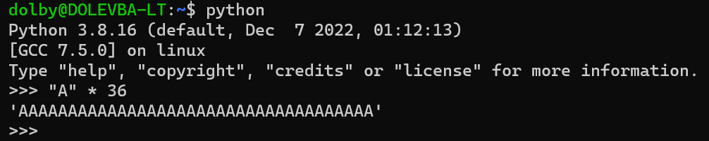
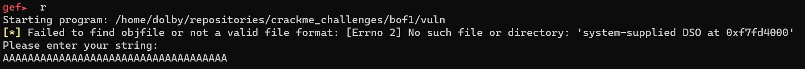
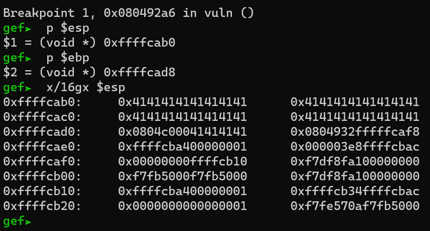
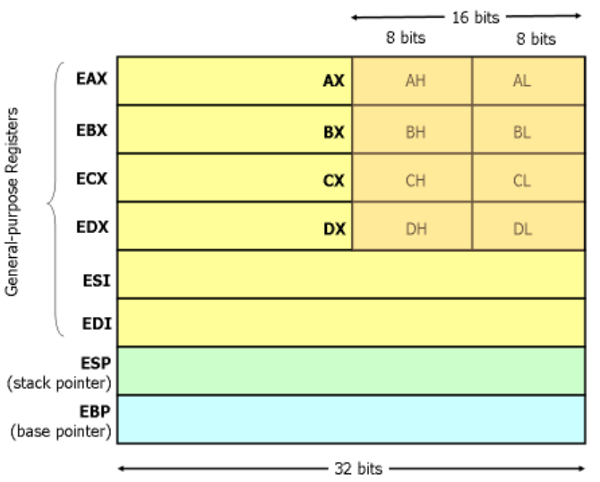

# Buffer overflow 1

The primary aspect that stands out here is the method for determining the byte count during buffer overflow.

To begin, our initial focus will be solely on populating the buffer with a repetition of "AAA" characters.

By subtracting the address `0xcab0` from `0xcad8`, we obtain a result of 40, which aligns with the buffer size. Consequently, only 8 bytes remain to fill the ebp register.

After filling 36 bytes, it is crucial to consider stack alignment. To reach the desired address `0xcad8`, an additional 4 bytes must be filled.

Furthermore, it is worth noting that the ebp register consists of 32 bits, necessitating an additional 4 bytes to be filled.  

Overall, we need to set the length of junk to be 44, which is calculated as the sum of (36 + 4 + 4 = 44)

Thanks for reading.
