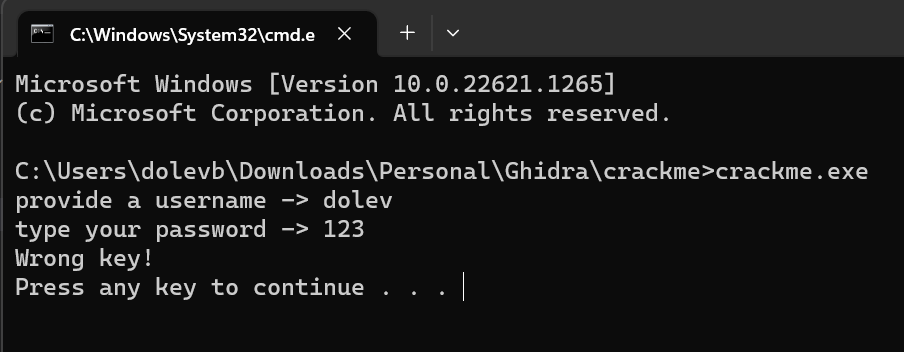
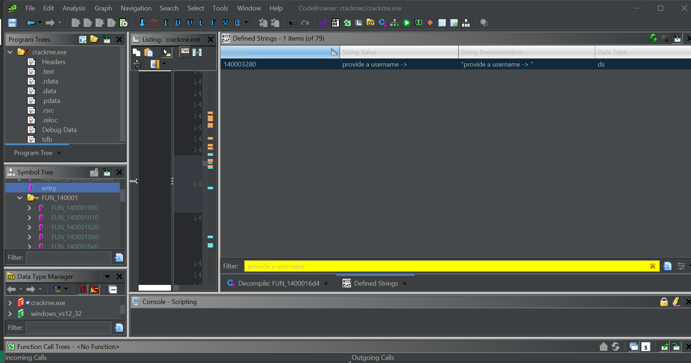

# Challenge 1
If you'd like to follow along, you can download the attached executable file and use the instructions provided below to reverse engineer it

I used Ghidra to decompile the code and I'll attach the relevant decompiled code below for reference.

First, let's take a look at the main function. I will add comments in the code to make it easier to read.

Also in parallel, I run the exe and try to seek for interesting strings.
```C
uint FUN_1400016d4(void){
  undefined8 uVar1;
  bool bVar2;
  int iVar3;
  ulonglong uVar4;
  code **ppcVar5;
  longlong *plVar6;
  undefined8 uVar7;
  undefined8 *puVar8;
  uint *puVar9;
  ulonglong uVar10;
  uint unaff_EBX;
  undefined8 in_R9;
  
  uVar4 = __scrt_initialize_crt(1);
  if ((char)uVar4 == '\0') {
    FUN_140001d48(7);
  }
  else {
    bVar2 = false;
    uVar4 = __scrt_acquire_startup_lock();
    unaff_EBX = unaff_EBX & 0xffffff00 | (uint)(uVar4 & 0xff);
    if (DAT_1400055b0 != 1) {
      if (DAT_1400055b0 == 0) {
         DAT_1400055b0 = 1;
         iVar3 = _initterm_e(&DAT_140003218,&DAT_140003230);
         if (iVar3 != 0) {
           return 0xff;
         }
         _initterm(&DAT_140003200,&DAT_140003210);
         DAT_1400055b0 = 2;
      }
      else {
         bVar2 = true;
      }
      __scrt_release_startup_lock((char)(uVar4 & 0xff));
      // A function that returns 1 variable, doesn't look interesting.
      ppcVar5 = (code **)FUN_140001d30();
      if ((*ppcVar5 != (code *)0x0) &&
          (uVar4 = FUN_140001af4((longlong)ppcVar5), (char)uVar4 != '\0')) {
         (**ppcVar5)(0,2);
      }
      // A function that returns 1 variable, doesn't look interesting.
      plVar6 = (longlong *)FUN_140001d38();
      if ((*plVar6 != 0) && (uVar4 = FUN_140001af4((longlong)plVar6), (char)uVar4 != '\0')) {
         _register_thread_local_exe_atexit_callback(*plVar6);
      }
      uVar7 = _get_initial_narrow_environment();
      puVar8 = (undefined8 *)__p___argv();
      uVar1 = *puVar8;
      puVar9 = (uint *)__p___argc();
      uVar10 = (ulonglong)*puVar9;
      // This one looks interesting and the return value is also the exit value.
      unaff_EBX = FUN_1400010e0(uVar10,uVar1,uVar7,in_R9);
      uVar4 = FUN_140001e9c();
      if ((char)uVar4 != '\0') {
         if (!bVar2) {
           _cexit();
         }
         __scrt_uninitialize_crt(CONCAT71((int7)(uVar10 >> 8),1),'\0');
         return unaff_EBX;
      }
      goto LAB_140001840;
    }
  }
  FUN_140001d48(7);
LAB_140001840:
  exit(unaff_EBX);
}
```



Both of the findings lead me to a function I called user_name_pass

```C
// renamged to user_name_pass
void FUN_1400010e0(undefined8 user_name,undefined8 param_2,undefined8 param_3,undefined8 param_4){
  code *pcVar1;
  ulonglong uVar2;
  longlong lVar3;
  BOOL BVar4;
  HANDLE pvVar5;
  longlong lVar6;
  PBOOL pBVar7;
  undefined auStack_a8 [32];
  ulonglong local_88;
  BOOL local_80 [2];
  ulonglong local_78;
  undefined8 local_70;
  undefined4 uStack_68;
  undefined4 uStack_64;
  undefined8 local_60;
  undefined4 local_58;
  undefined2 local_54;
  undefined local_52;
  char local_38 [40];
  ulonglong local_10;
  
  local_10 = DAT_140005008 ^ (ulonglong)auStack_a8;
  local_80[0] = 0;
  pvVar5 = GetCurrentProcess();
  pBVar7 = local_80;
  BVar4 = CheckRemoteDebuggerPresent(pvVar5,pBVar7);
  if (BVar4 != 0) {
    BVar4 = IsDebuggerPresent();
    if (BVar4 == 0) {
      local_88 = 0;
      local_78 = 0;
      // print to screen
      FUN_140001020("provide a username -> ",pBVar7,param_3,param_4);
      // get input from user.
      FUN_140001080(&DAT_140003298,local_38,param_3,param_4);
      lVar3 = -1;
      do {
         lVar6 = lVar3;
         lVar3 = lVar6 + 1;
      } while (local_38[lVar6 + 1] != '\0');
      if (lVar6 - 4U < 0x1a) {
        // this function calculate the password and save it in local_88
         FUN_1400012d0(local_38,&local_88,param_3,param_4);
         local_80[0] = 0;
         pvVar5 = GetCurrentProcess();
         pBVar7 = local_80;
         BVar4 = CheckRemoteDebuggerPresent(pvVar5,pBVar7);
         if (BVar4 != 0) {
           BVar4 = IsDebuggerPresent();
           if (BVar4 == 0) {
            // rename this function from FUN_140001020 to print
             FUN_140001020("type your password -> ",pBVar7,param_3,param_4);
             // rename from FUN_140001080 to get user input
             // See point (4) below
             FUN_140001080(&DAT_1400032e0,&local_78,param_3,param_4);
             uVar2 = local_78;
             local_80[0] = 0;
             pvVar5 = GetCurrentProcess();
             pBVar7 = local_80;
             BVar4 = CheckRemoteDebuggerPresent(pvVar5,pBVar7);
             if (BVar4 != 0) {
               BVar4 = IsDebuggerPresent();
               if (BVar4 == 0) {
                  // See point (3) below
                  if (uVar2 == local_88) {
                    local_58 = 0x6e656779;
                    local_54 = 0xa2e;
                    local_52 = 0;
                    // See point (1) below
                    local_70 = 0x656e6f206563694e;
                    uStack_68 = 0x6f6e2021;
                    uStack_64 = 0x6d202c77;
                    local_60 = 0x656b206120656b61;
                  }
                  else {
                    // See point (2) below
                    local_70 = 0x656b20676e6f7257;
                    uStack_68 = 0xa2179;
                  }
                // print -> nice one or wrong one
                  FUN_140001020(&DAT_140003298,&local_70,param_3,param_4);
                  system("pause");
                  goto LAB_140001290;
               }
             }
             FUN_140001580(pvVar5,pBVar7,param_3,param_4);
             pcVar1 = (code *)swi(3);
             (*pcVar1)();
             return;
           }
         }
         FUN_140001580(pvVar5,pBVar7,param_3,param_4);
         pcVar1 = (code *)swi(3);
         (*pcVar1)();
         return;
      }
      puts("Username length is out of range.\n");
LAB_140001290:
      FUN_1400015d0(local_10 ^ (ulonglong)auStack_a8);
      return;
    }
  }
  FUN_140001580(pvVar5,pBVar7,param_3,param_4);
  pcVar1 = (code *)swi(3);
  (*pcVar1)();
  return;
}
```
1. After converting `0x656e6f206563694e` to ascii we are getting -> `"eno eciN"`. littel endian to big endian -> `"Nice one"`. This is a good lead for condition check.
2. `0x656b20676e6f7257` hex to ascii -> `"ek gnorW"` little to big -> `"Wrong one"`
3. The condition `uVar2 == local_88` decide if we succsedded or failed.
4. the password saved in `local_78` which after that became `uVar2` so the only thing left is to understand how `local_88` is calculated.

Now let's see how the password is calculated and translate it to python.

```C
// First parameter name changed to user_name 
void FUN_1400012d0(char *user_name,ulonglong *param_2,undefined8 param_3,undefined8 param_4){
  char *pcVar1;
  char cVar2;
  code *pcVar3;
  BOOL BVar4;
  HANDLE pvVar5;
  longlong lVar6;
  ulonglong uVar7;
  int iVar8;
  ulonglong uVar9;
  char *pcVar10;
  int iVar11;
  PBOOL pBVar12;
  ulonglong uVar13;
  undefined2 *puVar14;
  undefined auStack_148 [32];
  ulonglong local_128 [30];
  BOOL local_38 [2];
  // local_30 was premitive but treated as buffer so i changed it.
  // undefined2 local_30; changed to the below.
  int8_t local_30[30];  
  undefined local_2e [16];
  undefined8 local_1e;
  undefined4 local_16;
  ulonglong local_10;
  
  local_10 = DAT_140005008 ^ (ulonglong)auStack_148;
  local_38[0] = 0;
  pvVar5 = GetCurrentProcess();
  pBVar12 = local_38;
  BVar4 = CheckRemoteDebuggerPresent(pvVar5,pBVar12);
  if ((BVar4 == 0) || (BVar4 = IsDebuggerPresent(), BVar4 != 0)) {
    FUN_140001580(pvVar5,pBVar12,param_3,param_4);
    pcVar3 = (code *)swi(3);
    (*pcVar3)();
    return;
  }
  local_30[0] = 0x30;
  local_1e = 0;
  local_16 = 0;
  local_2e = ZEXT816(0);
  memset(local_128,0,0xf0);
  uVar13 = 0xffffffffffffffff;
  iVar11 = 0;
  lVar6 = -1;
  // ============= see bullet 1 below ===============
  // calculating the length of the array
  do {
    lVar6 = lVar6 + 1;
  } while (user_name[lVar6] != '\0');
  if (lVar6 != 0) {
    uVar9 = 0;
    do {
      user_name[uVar9] = user_name[uVar9] + ((char)iVar11 + 1U ^ 0x30);
      // means that uVar7 = -1 
      // Because of do while loop the index statart from -1
      uVar7 = 0xffffffffffffffff;
      iVar11 = iVar11 + 1;
      uVar9 = (ulonglong)iVar11;
      // calculate the size of string in every iteration
      // highly inafficient.
      do {
         uVar7 = uVar7 + 1;
      } while (user_name[uVar7] != '\0');
      // Iterate over all the array.
    } while (uVar9 < uVar7);
  }
  // ================================================
  // ============= see bullet 2 below ===============
  iVar11 = 0;
  lVar6 = -1;
  // Calculate the length of the array again.
  do {
    lVar6 = lVar6 + 1;
  } while (user_name[lVar6] != '\0');
  if (lVar6 != 0) {
    uVar9 = 0;
    do {
      user_name[uVar9] = user_name[uVar9] + ((byte)iVar11 & 0x10);
      // Again calculate the size in every iteration
      uVar7 = 0xffffffffffffffff;
      iVar11 = iVar11 + 1;
      uVar9 = (ulonglong)iVar11;
      do {
         uVar7 = uVar7 + 1;
      } while (user_name[uVar7] != '\0');
    } while (uVar9 < uVar7);
  }
  // ================================================
  // ============= see bullet 3 below ===============
  iVar11 = 0;
  lVar6 = -1;
  // Calculate size
  do {
    lVar6 = lVar6 + 1;
  } while (user_name[lVar6] != '\0');
  // Save pointer to user_name in a new variable.
  pcVar10 = user_name;
  if (lVar6 != 0) {
    do {
        // add ~ to every item in array.
      *pcVar10 = *pcVar10 + '~';
      iVar11 = iVar11 + 1;
      // calculate size in every iteration
      uVar9 = 0xffffffffffffffff;
      do {
         uVar9 = uVar9 + 1;
      } while (user_name[uVar9] != '\0');
      pcVar10 = pcVar10 + 1;
    } while ((ulonglong)(longlong)iVar11 < uVar9);
  }
  // ================================================
  // ============= see bullet 4 below ===============
  // Calculate size of user name
  uVar9 = 0xffffffffffffffff;
  do {
    uVar9 = uVar9 + 1;
  } while (user_name[uVar9] != '\0');
  iVar11 = 0;
  if (uVar9 != 0) {
    puVar14 = &local_30;
    do {
      iVar11 = iVar11 + 1;
      *(char *)puVar14 =
            *(char *)(((longlong)user_name - (longlong)&local_30) + (longlong)puVar14) * '\x05';
        // Basically the same as
        /*
          int64_t debug1 = ((int64_t)user_name - (int64_t)&local_30);
          int64_t debug2 = debug1 + (int64_t)p_local_30;
          *(char *)p_local_30 = (*(char *)debug2) * '\x05';
        */
        // BUTTT are we really considerind the value of the local_30 address?
        // This doesn't make any sense because for a keygen there is no option to predict this address.
        // But notice that line after that the same address is added so the reference to this address has no meanning (int64_t)p_local_30
        // So to simplify the equesion above we can just write:
        /*
          *(char *)p_local_30 = user_name[iVar10 - 1] * '\x05';
          p_local_30 = (int64_t *)((int64_t)p_local_30 + 1);
        */
        // Or even simpler:
        /*
        for(int i = 0; i < uVar8; i++){
          local_30[i] = user_name[i] * '\x05';
        }  
        */
      puVar14 = (undefined2 *)((longlong)puVar14 + 1);
    } while ((ulonglong)(longlong)iVar11 < uVar9);
  }
  // ================================================
  // ============= see bullet 5 below ===============
  // concatenate user_name and local_30 
  // like user_name + local_30
  pcVar10 = user_name + -1;
  do {
    pcVar1 = pcVar10 + 1;
    pcVar10 = pcVar10 + 1;
  } while (*pcVar1 != '\0');
  puVar14 = &local_30;
  lVar6 = 0;
  do {
    cVar2 = *(char *)((longlong)puVar14 + lVar6);
    pcVar10[lVar6] = cVar2; // don't be confuse index 0 is after offset.
    lVar6 = lVar6 + 1;
  } while (cVar2 != '\0');
  // ================================================
  // ============= see bullet 6 below ===============
  do {
    uVar13 = uVar13 + 1;
  } while (user_name[uVar13] != '\0');
  iVar11 = 0;
  if (uVar13 != 0) {
    do {
      cVar2 = *user_name;
      user_name = user_name + 1;
      iVar8 = iVar11 * iVar11;
      iVar11 = iVar11 + 1;
      local_128[0] = local_128[0] + (longlong)(cVar2 + iVar8);
    } while ((ulonglong)(longlong)iVar11 < uVar13);
  }
  // Same as:
  /*
    for(int i = 0; i < uVar12; i++){
        local_128[0] += i*i + user_name[i];
    }
  */
  // ================================================
  // ============= see bullet 7 below ===============
  local_38[0] = 0;
  pvVar5 = GetCurrentProcess();
  pBVar12 = local_38;
  BVar4 = CheckRemoteDebuggerPresent(pvVar5,pBVar12);
  if ((BVar4 != 0) && (BVar4 = IsDebuggerPresent(), BVar4 == 0)) {
    uVar13 = (local_128[0] >> 0x1e ^ local_128[0]) * -0x40a7b892e31b1a47;
    uVar13 = (uVar13 >> 0x1b ^ uVar13) * -0x6b2fb644ecceee15;
    *param_2 = uVar13 >> 0x1f ^ uVar13;
    FUN_1400015d0(local_10 ^ (ulonglong)auStack_148);
    return;
  }
  // Same as
  /*
    uint64_t temp1 = (uint64_t)13787848793156543929ULL;
    uint64_t temp2 = (uint64_t)10723151780598845931ULL;
    uVar12 = (local_128[0] >> 0x1e ^ local_128[0]) * temp1;
    uVar12 = (uVar12 >> 0x1b ^ uVar12) * temp2;
    *final_password = uVar12 >> 0x1f ^ uVar12;
  */
  // ================================================
  FUN_140001580(pvVar5,pBVar12,uVar13,puVar14);
  pcVar3 = (code *)swi(3);
  (*pcVar3)();
  return;
}
```
0. You may notice that I have used this function int8_wraparound. this is because I had to simulate integer warparound synthetically. This is the implementation.
    ```python
    def int8_wraparound(num, add):
        sum = (num + add)
        if sum <= 127:
            return sum
        base = -128
        if sum % 128 == 0:
            base = 0
        return (sum % 128) + base
    ```
1. This one is equivelent to this python code
    ```python
    for i in range(len(user_name)):
        user_name[i] = int8_wraparound(user_name[i], (i + 1 ^ 0x30))
    ```
2. Equivelent python code:
    ```python
    for i in range(len(user_name)):
        user_name[i] = int8_wraparound(user_name[i], (i & 0x10))
    ```
3. Equivelent python code:
    ```python
    # ~ in ascii -> 126
    for i in range(len(user_name)):
        user_name[i] = int8_wraparound(user_name[i], 126)
    ```
4. Equivelent python code:
    ```python
    temp_arr = [int8_wraparound(i * 5, 0) for i in user_name]
    ```
5. Equivelent python code:
    ```python
    concatenated = user_name + temp_arr
    ```
6. Equivelent python code:
    ```python
    num = 0
    for i in range(len(concatenated)):
        num += i*i + concatenated[i]
    ```
7. Writing the equivelent python code is a bit challenging. The C code does it's best in order to achive integer wraparround. My first python code was:
    ```python
    uVar12 = uint64_wraparound((num >> 0x1e ^ num) * 13787848793156543929)
    uVar12 = uint64_wraparound((uVar12 >> 0x1b ^ uVar12) * 10723151780598845931)
    return uint64_wraparound(uVar12 >> 0x1f ^ uVar12)
    ```
    The real catch is in the function uint64_wraparound. My first implementation was:
    ```python
    def uint64_wraparound(num):
        return num % (0xffffffffffffffff + 1)
    ```
    which suppose to make sense. But god knows why I got the wrong precision. So in order to achive accurate precision I changed the function to
    ```python
    def uint64_wraparound(num):
        return num & 0xffffffffffffffff
    ```
    That ofcourse also make sense because this is basiclly Modulo.

The complete python code is attached in this repository and you can use is as keygen.

## Enjoy
