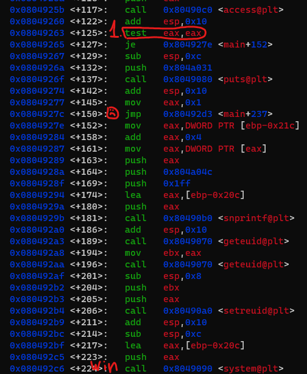

ssh leviathanX@leviathan.labs.overthewire.org -p 2223

## leviathan0

```bash
cat .backup/bookmarks.html | grep leviathan
```
username: leviathan1  
pass: PPIfmI1qsA

## leviathan1
Run the program check with gef(gdb) examine the eax before strcompare.
Set the password 'sex'  
```bash
cat /etc/leviathan_pass/leviathan2
```

username: leviathan2  
pass: mEh5PNl10e

## leviathan2

Let's find leviathan3 user ID
```bash
leviathan2@gibson:~$ cut -d: -f1,3 /etc/passwd | awk -F: '{ printf "Username: %s, UID: %s\n", $1, $2 }' | grep levi
Username: leviathan0, UID: 12000
Username: leviathan1, UID: 12001
Username: leviathan2, UID: 12002
Username: leviathan3, UID: 12003
Username: leviathan4, UID: 12004
Username: leviathan5, UID: 12005
Username: leviathan6, UID: 12006
Username: leviathan7, UID: 12007
```

```
gef ./printfile  
set args "/etc/leviathan_pass/leviathan3"  
b *main+125
b *main+204  
b *main+229
r
set $eax=0
c
set $eax=12003
set $ebx=12003
```

Well... All of the above did't work and let me tell you a story why...

Linux File Permissions  

I recently completed a Capture The Flag (CTF) challenge, and to be honest, I managed to find two solutions without fully understanding why they worked.  
  
Firstly let me provide a brief introduction. I had an executable that checked if I had permission to read a file. If I did, it would evaluate the euid and read the file.

Here are the permissions of the executable:  
`-r-sr-x---  1 leviathan3 leviathan2 15060 Oct  5 06:19 printfile
`  
While logged in as leviathan2, I examined the assembly code presented in the picture.

Now, to me, this code seemed to hint at a race condition. Why? How? IDK, but that was my intuition. So, I wrote a [script](./leviathan2/race_condition.sh) to toggle a symlink between a file I had permissions to read and the file that contained the CTF challenge, and voila, I solved it. I scratched my head, wondering why this was working and how it was possible for software to evaluate permissions.

I decided to run this executable using GDB to understand how it works, but my attempts kept failing. Frustrated, I tried another approach. I created a file in the temp directory and named it "file;bash." Since this code calls the system with the file name, I thought I could inject my code. Surprisingly, this approach worked too.

The next day, I discussed this strange behavior with a colleague, and he explained that it all boiled down to the 's' in the file permissions. You see, the file permissions were "-r-sr-x---," indicating that it could evaluate the euid to the file owner. However, I was puzzled about why it didn't work when I tried to run it using GDB. Well my little friend said the colleague, you need to understand that GDB could modify the process memory using ptrace, and the kernel would block any permissions evaluation when someone accessed the process using a tool like GDB that inspects and modifies another process using ptrace.


username: leviathan3  
pass: Q0G8j4sakn  


## leviathan3
I'm not sure what this challenge is about
I ran this like 
```
leviathan3@gibson:~$ ltrace ./level3
__libc_start_main(0x80492bf, 1, 0xffffd5f4, 0 <unfinished ...>
strcmp("h0no33", "kakaka")                                                                                                       = -1
printf("Enter the password> ")                                                                                                   = 20
fgets(Enter the password> l
"l\n", 256, 0xf7e2a620)                                                                                                    = 0xffffd3cc
strcmp("l\n", "snlprintf\n")                                                                                                     = -1
puts("bzzzzzzzzap. WRONG"bzzzzzzzzap. WRONG
)                                                                                                       = 19
+++ exited (status 0) +++
```

I saw this 
strcmp("l\n", "snlprintf\n")  
Tha't it. I figure out the password I guess.


username: leviathan4  
pass: AgvropI4OA  

## leviathan4

Just run the program and convert bin to ascii
username: leviathan5 
pass: EKKlTF1Xqs  

## leviathan5

ln -s /etc/leviathan_pass/leviathan6 /tmp/file.log

username: leviathan6 
pass: YZ55XPVk2l  

## leviathan6
Extreamlly simple reversing:
```asm
lea    ecx,[esp+0x4]
and    esp,0xfffffff0
push   DWORD PTR [ecx-0x4]
push   ebp
mov    ebp,esp
push   ebx
push   ecx
sub    esp,0x10
mov    eax,ecx
mov    DWORD PTR [ebp-0xc],0x1bd3
cmp    DWORD PTR [eax],0x2
je     0x8049216 <main+64>
mov    eax,DWORD PTR [eax+0x4]
mov    eax,DWORD PTR [eax]
sub    esp,0x8
push   eax
push   0x804a008
call   0x8049050 <printf@plt>
add    esp,0x10
sub    esp,0xc
push   0xffffffff
call   0x8049090 <exit@plt>
mov    eax,DWORD PTR [eax+0x4]
add    eax,0x4
mov    eax,DWORD PTR [eax]
sub    esp,0xc
push   eax
call   0x80490b0 <atoi@plt>
add    esp,0x10
cmp    DWORD PTR [ebp-0xc],eax
jne    0x804925a <main+132>
call   0x8049060 <geteuid@plt>
mov    ebx,eax
call   0x8049060 <geteuid@plt>
sub    esp,0x8
push   ebx
push   eax
call   0x80490a0 <setreuid@plt>
add    esp,0x10
sub    esp,0xc
push   0x804a022
call   0x8049080 <system@plt>
```
./leviathan6 7123

username: leviathan6  
pass: 8GpZ5f8Hze  
